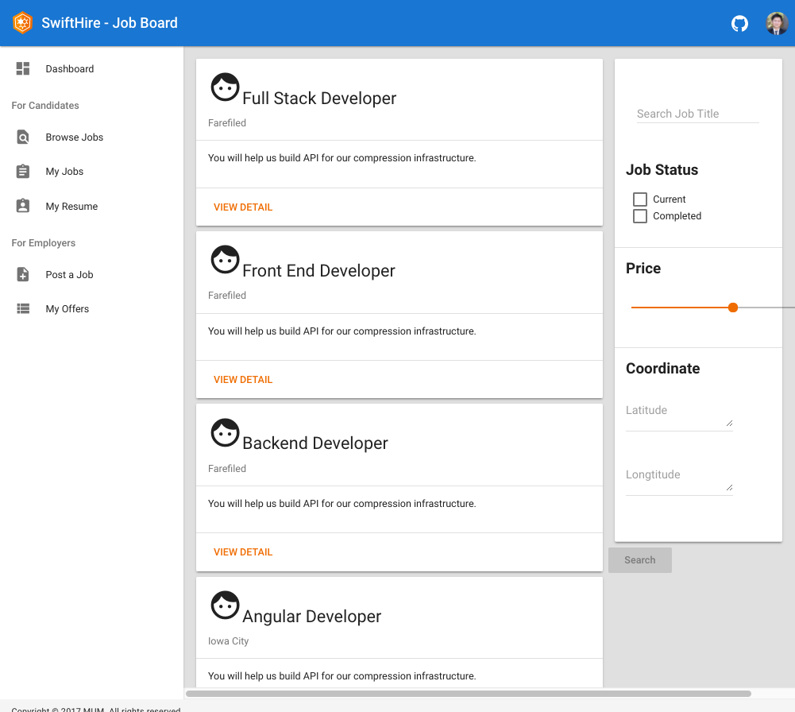

# SwiftHire: A Part-Time Jobs Application
A MEAN Stack application offering a platform for part-time job seekers and employers who have opportunities for hourly-based paying jobs.

## Application specifications and requirements
* All users must login to use the system and see the homepage.
* All users can apply for a job vacancy or post a job opportunity for other users.
* Every user will have a profile picture.
* Every user will have rating and comments section attached to their profiles.
* The system will offer the services based on location, so your homepage should display the nearest 10
jobs from the current user location sorted by date (today first, future last).
* There will always be a link at the top of your application for user to post a new job opportunity.
* Every job should have at least the following properties: Name, description, category, location, duration
per hour, hourly fees rate, preferred date, preferred time.
* A user may apply to a job and his name will be added to a waiting list, the job owner will have to choose
one candidate for the job (mostly will choose a user with highest rate and nice comments).
* Once the job date is in the past the job owner should be able to rate the candidate and write a comment
about them whether they did a good job or not. Rating and comments are part of every user profile.
* On the other hand, users who did the job will also rate the job owner and write a comment about them
whether they have been treated nicely and got paid as promised.
* Your application must have a search form to search for job vacancies by category, location, minimum
fees amount.
* Don’t show job opportunities on your homepage if the date is older than today. Sort the jobs by date
from today until the future.
* When a job owner chooses a candidate for the job, it will no longer appear on the homepage nor in
search results even if its date is in the future.

## Technical information
* You must use all the technologies we learned in our course (NodeJS/Express, MongoDB,
Angular)
* Design your own DB, skeleton and app structure. Start by planning your screens and split your
work between all members.
* Every team member should be responsible for implementing at least one use-case from start to
end.
* For layout, you may use components from Angular material module https://material.angular.io
* There will be no need to have a sign-up page, use some ready services to authenticate your
users (Auth0 or Firebase)
* All Angular routes should be protected from public access by JWT
* All Express routes should be protected from public access by JWT
* Each team must have one online SVN repo (Git is advised).
* Hosting your project online will yield to one extra point to all team members having they
completed the requirements, you may use Github pages for Angular app, Heroku for Node and
mLab for MongoDB. Amazon Web Services offer a good free package too. Google Cloud
platform is good option!

## Screenshot

